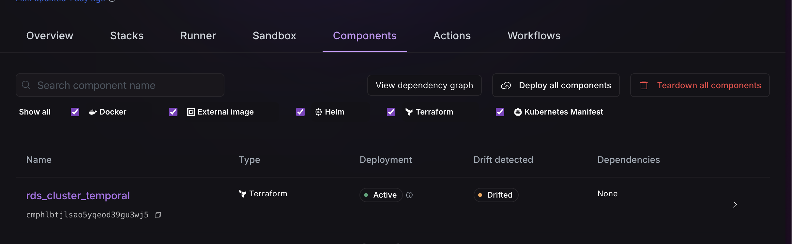
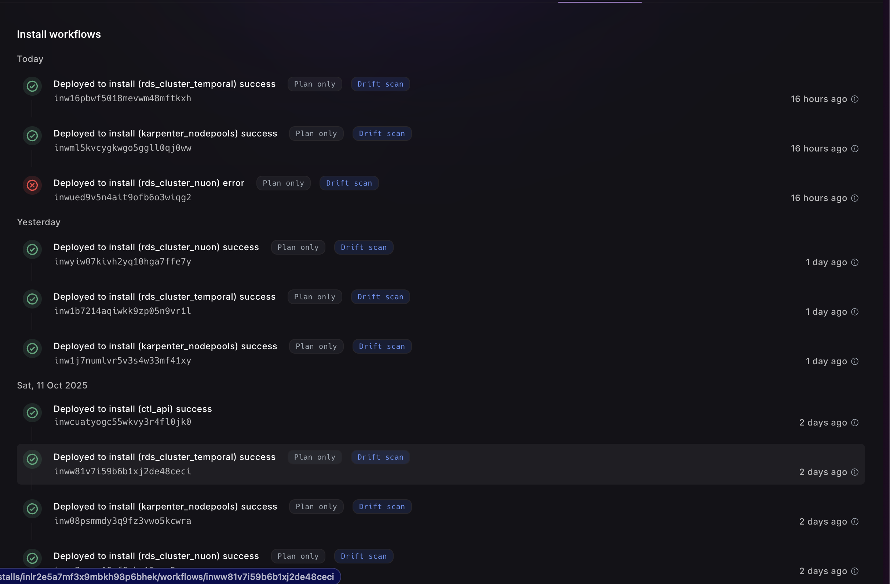
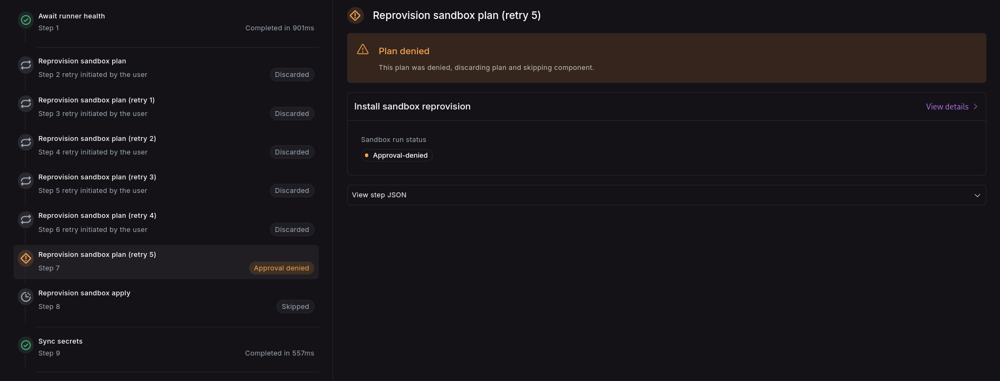

_Oct 13, 2023_

<div className="badge badge--primary">v0.19.662</div>

## Drift Detection

Drift detection allows you to automatically identify discrepancies between your defined infrastructure and what's
actually running. You can now configure periodic drift detection checks for components and sandboxes through a simple
cron schedule.

## Features

### Drift Detection for Sandboxes

You can now define a cron schedule in your `sandbox.toml` that periodically checks for drift by performing a "terraform
plan":

```toml
terraform_version = "1.11.3"
drift_schedule = "0 * * * *"  # Runs every hour at minute 0
```

### Drift Detection for Components

Similarly, drift detection can be configured at the component level for Terraform, Helm, and Kubernetes Manifest
components.

Example for a Helm component:

```toml
name = "helm_chart"
type = "helm_chart"
chart_name = "nuon"
namespace = "{{.nuon.install.id}}-test"
storage_driver = "configmap"
drift_schedule = "0 * * * *"  # Runs every hour at minute 0
```

> **Note:** Changes to drift_schedule require rebuilding the sandbox or component to take effect.

### Drift Visibility

The install components page now clearly highlights components that have drifted from their defined state and provides
direct links to the relevant workflows to review the differences.


Install workflows page also marks the workflows that are drift scans.


## Limitations

**Current Workflow Constraint:** At present, only one workflow can run per install at a time. This means:

- If a drift detection workflow is running when you attempt to manually deploy a component or reprovision a sandbox,
  your workflow will be queued until the drift workflow completes.
- We're actively working to remove this limitation in an upcoming release.

## Bug Fixes and Improvements

- Improvements to generate steps to improve resilience in Temporal.
- Fix to disable server side apply on helm client for components.
- Fix where some Nuon plans can not be generated if outputs are not ready yet.

### Deny plans and continue workflow

We can now deny plan and continue with the workflow with rest of the component. Deny button comes with additional option
to deny and skip steps.



### Actions TUI

Actions and Action Runs for installs can now be viewed via the cli.

```bash
NUON_PREVIEW=true nuon installs actions
```


### Nuon Runner Cloudformation Stack

The stack has been updated to remove a policty in order to reduce permissions available to the Runner ASG instances. It
is recommended to update the stack to version `v0.1.8`.
