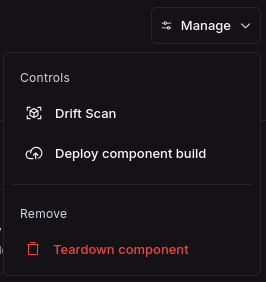

_Oct 27, 2024_

v0.19.678

## Drift Scanning Enhancements

We've significantly expanded our drift detection capabilities with new scanning features:

- **Component Drift Scanning**: You can now trigger drift scans directly from individual component pages to detect configuration drift at the component level.

- **Sandbox Drift Scanning**: Added drift scan functionality for sandbox environments, allowing you to identify discrepancies between expected and actual sandbox states.
- **Enhanced Drift Detection**: Improved the overall drift detection system to better identify and load drifted objects across your infrastructure.

## Workflow & Install Improvements

- **Workflow Retry Enhancements**: Re-enabled continuing temporal workflows for installs, providing better reliability for long-running deployment processes.
- **Break Glass Action Info**: Added comprehensive break glass information to action pages, giving you better visibility into emergency access procedures and their usage.
- **Performance Optimizations**: Implemented database query optimizations to resolve slow table queries and improve overall system responsiveness.

## Developer Experience

- **Enhanced Error Handling**: Improved error handling in post-install phone home functionality and workflow execution steps.
- **Debug Logging**: Added enhanced debug logging for workflow step execution to aid in troubleshooting.

## Infrastructure & Hosting

- **Self-Hosted Improvements**: Increased block storage allocation for self-hosted deployments to provide better performance and capacity.
- **Workflow Execution**: Fixed conditions for checking step status during workflow execution, improving reliability.
- **Image Sync**: Enhanced image sync workflow steps with better target information and debugging capabilities.

## Bug Fixes

- **Log Streams**: Fixed issue resulting in log streams not being closed properly.
- **Component Configuration**: Resolved issues with TOML parsing and component capability handling.
- **Resource Configuration**: Fixed various resource configuration-related bugs.
- **Validation**: Removed overly strict required validation from References field that was causing unnecessary errors.
- **API Documentation**: Fixed invalid Swagger documentation that was causing API reference issues.
- **Action Validation**: Resolved action run validation errors that were preventing successful action execution.

## Performance & Monitoring

- **Monitoring**: Added UI Datadog client integration and endpoint timing metrics for better observability.
- **Database Performance**: Implemented database stash updates and optimizations for improved query performance.
- **Error Handling**: Enhanced stderr handling and request body processing for better error reporting.
