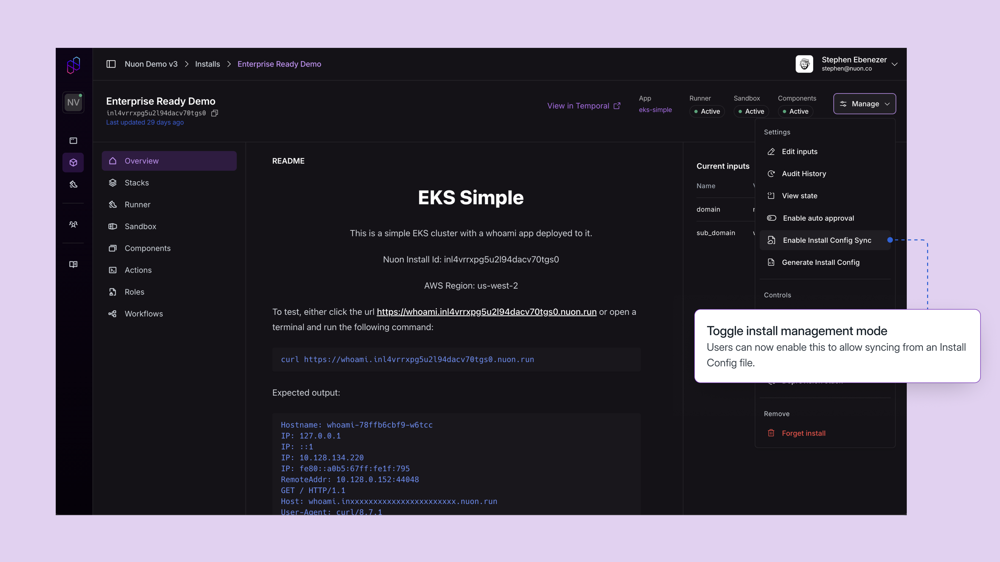
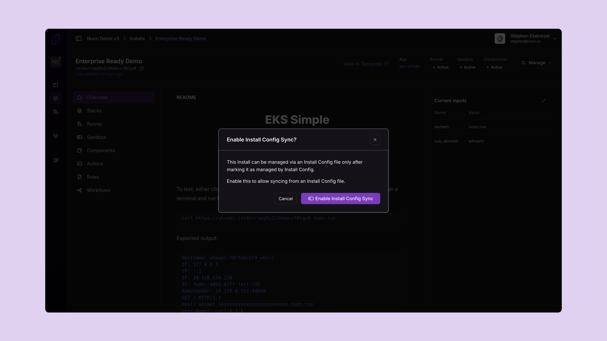
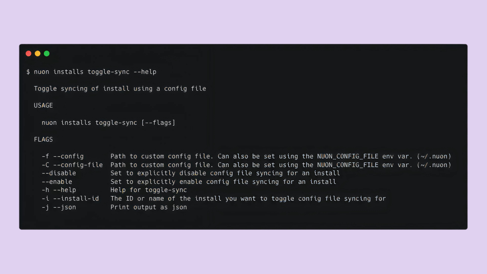
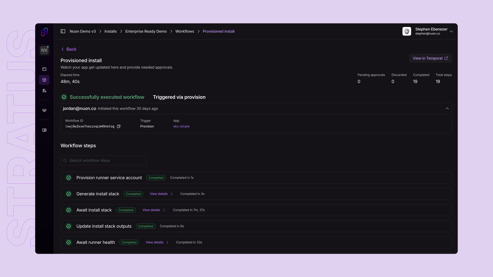
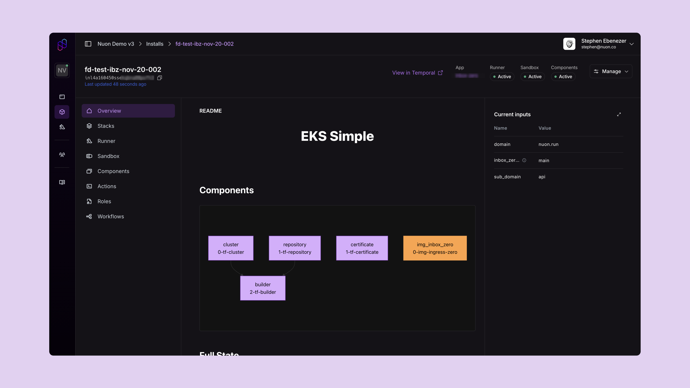

_Nov 20, 2025_

v0.19.706

## Install Config file improvements

### Toggle Install Config file syncing

Users can now enable or disable syncing an Install from a config file, from dashboard UI as well as CLI.

**Dashboard UI** You can find the toggle to enable/disable config file syncing in the management menu of an Install.

 

**CLI** The CLI features a new command to toggle config file syncing for an Install. Run `nuon installs toggle-sync` to toggle the config file syncing, or use `--enable` or `--disable` to explicitly set the syncing status.

### Required Inputs

Install Config files now need to have the required inputs defined explicitly. Now it is not 
possible to set their value from UI, or utilising the default value implicitly.

### UI Refresh

We've been rolling out our new design system to users, bringing a more modern and polished look to the dashboard. This update includes refreshed UI components, improved visual hierarchy, and a cleaner overall aesthetic for developer workflows.

If you would like to use the updated UI, reach out to our team so we can enable it for your organization. We would love to hear your feedback!

### Mermaid Diagrams in READMEs

READMEs now support [Mermaid](https://mermaid.js.org/) diagram rendering.

## Bug Fixes 

- UI: Fixed missing badge for Install managed by config file in the header.
- CLI: Fix empty diff when syncing a new install using a config file.
- CLI: Syncing an Install without having Install Config syncing enabled now results in an error. These only produced a warning before, going unnoticed in CI workflows. 
- UI: Fixed missing API URL in Terraform backend config download.
- Azure: Fixed phone home script in Azure install stack.
- CLI: Fixed new input values not syncing from install config files
