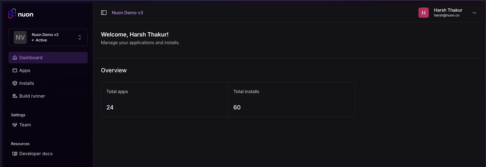

_Dec 24, 2025_

<div className="badge badge--primary">v1.0.0rc</div>

## Nuon is now Open Source 🎉

We're excited to announce that **Nuon is now open source**! The core platform powering BYOC deployments is now available on GitHub at [github.com/nuonco/nuon](https://github.com/nuonco/nuon).

This release marks a major milestone for Nuon, enabling the community to contribute, inspect, and build upon the platform.

## Nuon Labs

We've launched [Nuon Labs](https://labs.nuon.co/) — a place where we'll announce new and upcoming features, share experimental ideas, and give you early access to what we're building next. Check it out to stay ahead of the curve!

## New Features

### Organization Dashboard

A new organization dashboard provides visibility into your org's stats and usage at a glance.



### Real-time Streaming Logs

Logs throughout the dashboard now stream in real-time using Server-Sent Events (SSE), giving you instant visibility into workflow execution without manual refreshing.

### CLI `--no-input` Flag

The CLI install script now supports a `--no-input` flag for fully non-interactive installations, making it easier to integrate into CI/CD pipelines and automation scripts.

```bash
curl -sSL https://install.nuon.co | bash -s -- --no-input
```

### VS Code Extension & Language Server

Nuon now includes a Language Server Protocol (LSP) implementation with a [VS Code extension](https://marketplace.visualstudio.com/items?itemName=Nuon.nuon-lsp), providing autocomplete, validation, and inline documentation for Nuon configuration files.

### Templatable Stacks

Stacks now support templating, allowing you to parameterize and reuse stack configurations across different environments and installs.

## Bug Fixes

- UI: Fixed invalid state issue during multi-tab login
- UI: Login page button now uses proper `<a/>` tag for accessibility
- API: Fixed missing `org_id` bugs
- CLI: Fixed `nuon delete` command
- API: Fixed post-install validation response code
- API: Fixed error handling when getting workflow logger
