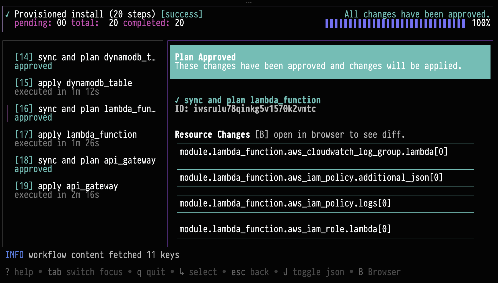

_Mar 25, 2026_

<div className="badge badge--primary">Since v0.19.821</div>

## Workflow TUI

The install workflows TUI is now generally available in the `nuon` CLI. The workflow TUI provides a single place to
follow workflow progress in real time, inspect step details, and take action all from the terminal.



Run `nuon installs workflows` to open a guided, interactive view of your install workflows. From there, you can review
plan diffs, approve steps, retry failed actions, and cancel workflows when needed. The experience is designed to make
day-to-day operations faster and easier for teams that work directly in CLI-first environments.

## Introducing CLI Extensions

We are introducing a way to extend the functionality of the Nuon CLI via custom extensions. Extensions are generally
available and work as first-class `nuon` commands. This enables teams to build tailored workflows directly into the CLI
usage.

We've authored a few extensions which are available now. For example, with `nuon api`, you can browse and call Nuon's
public API from the command line using a spec-driven client that supports interactive discovery and script-friendly
output.

Run `nuon extensions` to explore extensions.

```
nuon extensions browse
  NAME        VERSION     INSTALLED   REPO                    DESCRIPTION
 ──────────────────────────────────────────────────────────────────────────────────────────────────────
  api         v0.19.821   *           nuonco/nuon-ext-api     Nuon Extension: API Client
  render      v0.1.5      *           nuonco/nuon-ext-render  Nuon Extension: Utility to render app c…
```

Try out the `api` extension.

```
nuon extensions install nuonco/nuon-ext-api

nuon api --help
```

### Learn More

- [Nuon CLI Extensions](/guides/cli-extensions)

## Roles, Roles, and more Roles

We've spent some time improving the customer experience when disabling or disablign first class roles and we have
introduced a new feature: Operation Roles.

### Operation Roles

Actions can specify which roles they should be executed both, in config and in the UI. This makes it significantly
easier to make use of custom roles with scoped permissions. Addtionally, components can now define `operation_role`s
making it easy to select a role with the right permissions when a specific role is required. For example, when
reprovisioning a sandbox or deploying a component that touches CRDs. This new capability is surfaced in the UI in a new
role selector drop down.

### Learn More

- [Concepts: Operation Roles](/concepts/operation-roles)
- [Guides: Operation Roles](/guides/operation-roles)

## GCP

We are please to announce we now have robust support for Google Cloud Platform.

### Learn More

- [GCP GKE Sandbox](https://github.com/nuonco/gcp-gke-sandboxgcp-gke-sandbox)

## Dashboard UI Changes and Improvements

The nuon dashboard has an updated workflow UI with an emphasis on making operations easier to reason about.

- Added pending-approval toasts and notification improvements so approval-required workflows are easier to spot and
  action.
- Added org-level and install-level active workflow experiences
- Improved workflow detail panels with better logs and the ability to download logs.
- Improved approvals UX with better defaults and guardrails.
- Added warnings for duplicate builds making it easier to navigate the build when deploying components.
- Improved custom role selection for actions.
- Added quick-action improvements like forget install, ad-hoc action reruns, and better quick-menu loading behavior.
- Added role status indicators to make it easier to determine which roles are active on installs.

## Changed

- Improved `auth login` to better respect configured API URL.
- `installs create` now has support for install selection
- New `runner` group with `restart` and `shutdown` commands.
- Standardized `get`/`current` behavior. `current` is deprecated but will remain supported for some time.
- Fully deprecated `nuon apps sync` command.
- Dashboard UI now routes key surfaces through the SPA architecture, including onboarding, install components, admin
  panel, audit logs, and install config download.
- Workflow UX in dashboard now emphasizes active in-progress runs, surfaces pending approvals earlier, and improves
  plan/step visibility with better defaults and safeguards.
- Operation-role selection in ctl-api was hardened so planning and execution use the same role-resolution flow with
  stronger runtime override handling.
- Install role APIs in ctl-api were expanded and normalized so role availability/provisioning state is exposed
  consistently across clouds.
- Custom role enablement in install stack generation now defaults correctly when roles are referenced, with follow-up
  nil-safety fixes.
- GCP permission fields (GCPPermissions, GCPPredefinedRole, CloudPlatform) are now synced when converting IAM roles.
- Role configs now enforce platform validation to prevent misconfigured cloud-specific fields.
- Deploy flow step sequencing was refined, including noop output handling and retry-after-timeout scenarios.

## Added

- Added interactive app selection to `nuon installs create`. When `--app-id` is omitted, a new app selector contextual
  TUI Is surfaced.
- Added install runner management commands under `nuon installs runner` (`get`, `restart`, `shutdown-vm`).
- Added install workflow diff support in the workflow TUI.
- Added preview `nuon installs reprovision-sandbox` command to schedule sandbox reprovision workflows.
- Added dashboard support for org-level and install-level active workflow views, pending-approval notifications, and
  workflow log downloads.
- Added dashboard role-aware actions for reprovision and install input updates, plus role provision status visibility in
  install/app role workflows.
- Added ctl-api role override inputs for reprovision and install input update workflows so selected roles propagate into
  workflow creation.
- Added ctl-api support for GCP custom and break-glass role resolution in available-role and operation-role selection
  paths.
- Added richer sandbox fake stack outputs (custom roles, break-glass roles, and install inputs) to support role-aware
  sandbox-mode planning.
- Added new param to action config to allow toggle injection of kube config in action context.
- Added auto-retry toggle to the workflow TUI for retrying failed steps without leaving the TUI.
- Added break-glass directory support in the CLI.
