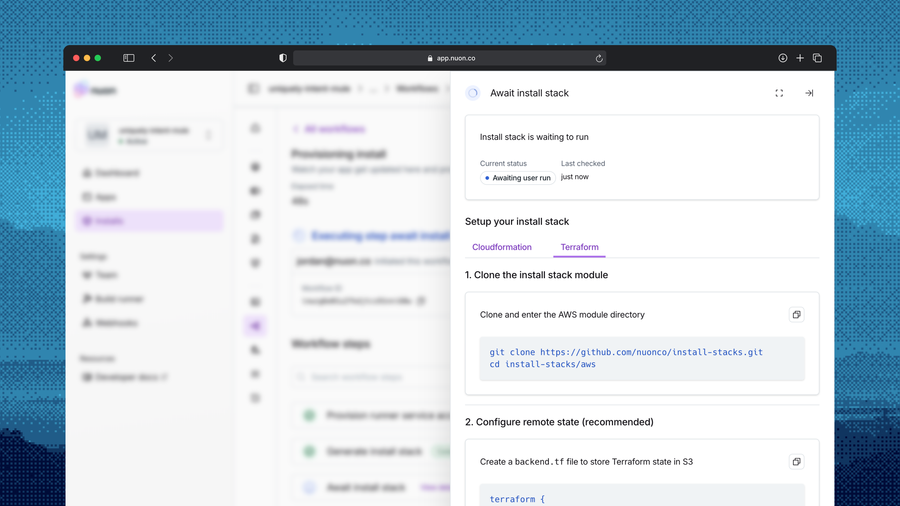

_May 4, 2026_

## Terraform Stack template for AWS

You can now provision [Stacks](/concepts/stacks) for AWS installs using Terraform.



Cloudformation is still supported, and you can choose either option when creating an install. The Terraform template will create the same resources as the Cloudformation template, and the resulting Stack will function exactly the same. The template is open source and can be found in the [nuonco/install-stacks](https://github.com/nuonco/install-stacks) repo.

If you use [custom nested stacks](/guides/custom-nested-stacks) in the Cloudformation template, you can customize the Terraform template by forking the repo, just like you would for any other Terraform module. Read the [Customizing Terraform Stack Templates](/guides/customizing-terraform-stack-templates) guide for more details.

## Webhooks

Org-scoped [Webhooks](/guides/webhooks) are now available. Nuon now POSTs workflow and workflow step lifecycle events to any HTTPS endpoint you register on your Org.

Manage webhooks from your org's **Webhooks** page in the [dashboard](https://app.nuon.co/) or from the CLI:

```sh
# List webhooks for the current Org
nuon orgs webhooks list

# Create a webhook (URL is required, secret is optional)
nuon orgs webhooks create --url https://example.com/webhooks/nuon --secret <shared-secret>

# Update a webhook's subscription scope and event filter
nuon orgs webhooks update --webhook-id <webhook_id> --subscription-file ./subscription.json
```

Each webhook supports an [interests filter](/guides/webhooks#filtering-events-with-interests) that narrows down which events get delivered, and a [match predicate](/guides/webhooks#scoping-deliveries-with-match) that scopes deliveries to specific installs, components, or actions.
