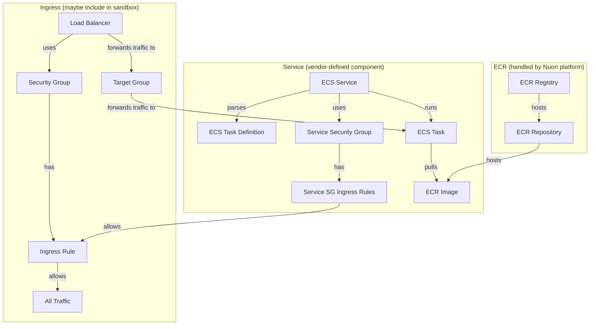

# Services

## ECS Sandbox Test Architecture

```mermaid
flowchart TD
    subgraph "Service (vendor-defined component)"
    srv[ECS Service]
    td[ECS Task Definition]
    task[ECS Task]
    srv_sg[Service Security Group]
    srv_sg_ir[Service SG Ingress Rules]

    srv-- parses -->td
    srv-- runs -->task
    task-- pulls -->ecr_image

    srv-- uses -->srv_sg
    srv_sg-- has -->srv_sg_ir
    end


    subgraph "Ingress (maybe include in sandbox)"
    lb[Load Balancer]
    lb_sg[Security Group]
    lb_sg_ir[Ingress Rule]
    lb_tg[Target Group]

    lb-- forwards traffic to -->lb_tg
    lb_tg-- forwards traffic to -->task

    lb-- uses -->lb_sg
    lb_sg-- has -->lb_sg_ir
    lb_sg_ir-- allows -->all[All Traffic]
    srv_sg_ir-- allows -->lb_sg_ir
    end


    subgraph "ECR (handled by Nuon platform)"
    ecr_reg[ECR Registry]
    ecr_repo[ECR Repository]
    ecr_image[ECR Image]

    ecr_reg-- hosts -->ecr_repo
    ecr_repo-- hosts -->ecr_image
    end
```
