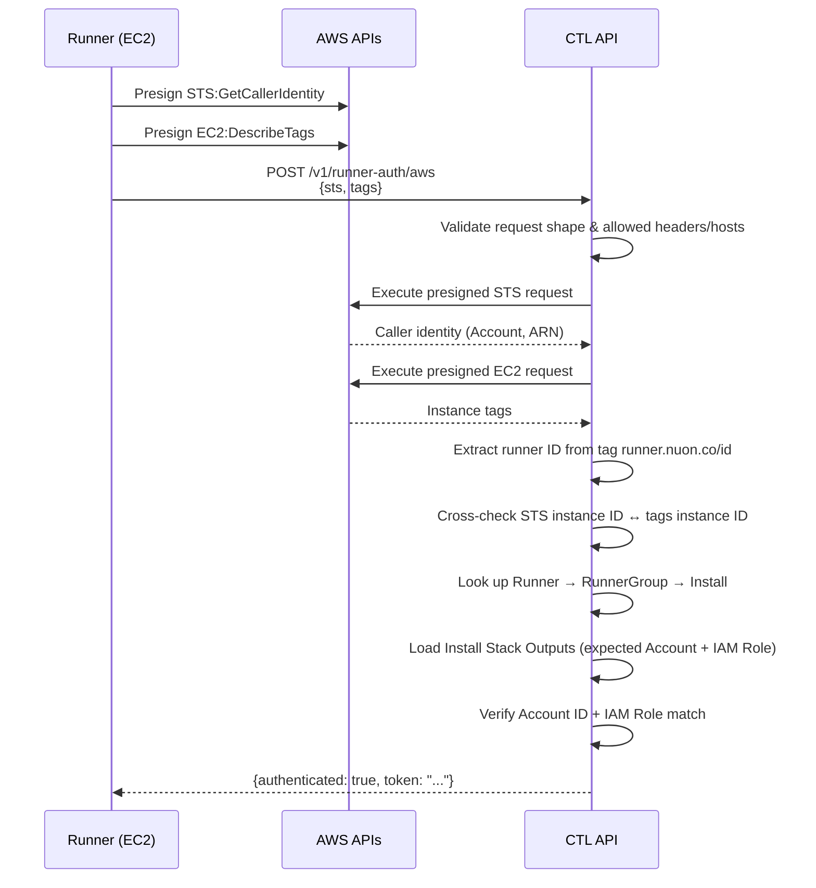
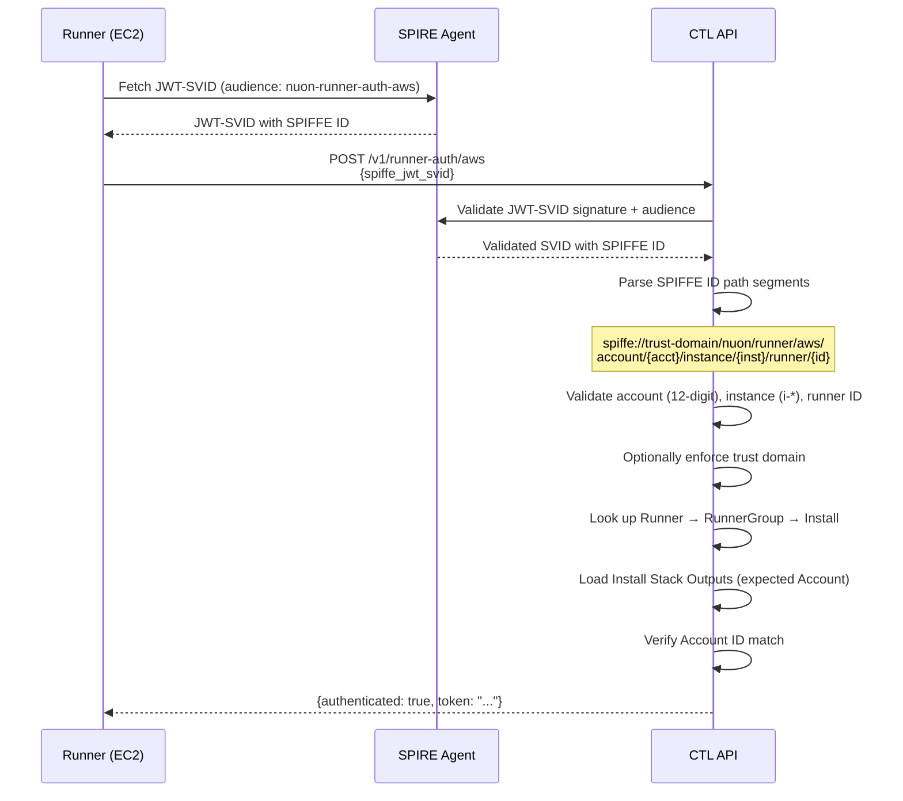

# Runner Auth: AWS Authentication

This document describes how runners authenticate with the control plane using AWS identity.

## Overview

Runners authenticate by calling `POST /v1/runner-auth/aws`. Two modes are supported — **presigned AWS requests** (legacy) and **SPIFFE/SPIRE JWT-SVIDs** (modern). Both issue a short-lived runner service-account token on success.

## Presigned AWS Mode



### Validation Steps

1. Only `GET` + `HTTPS` presigned requests are accepted.
2. STS host must match `sts[.region].amazonaws.com`, action must be `GetCallerIdentity`.
3. EC2 host must match `ec2.region.amazonaws.com`, action must be `DescribeTags`.
4. Only a strict allowlist of AWS Sigv4 headers is permitted.
5. The caller's AWS Account ID and IAM role name are compared against the install's `AWSStackOutputs`.

## SPIFFE/SPIRE Mode



### SPIFFE ID Format

```
spiffe://<trust-domain>/nuon/runner/aws/account/<aws-account-id>/instance/<ec2-instance-id>/runner/<runner-id>
```

## Mode Selection

The endpoint accepts either mode but not both in one request:

| Field             | Presigned | SPIFFE |
|-------------------|-----------|--------|
| `sts`             | required  | —      |
| `tags`            | required  | —      |
| `spiffe_jwt_svid` | —         | required |

Mixed payloads are rejected.

## Configuration

### Runner side

| Env Var | Default | Description |
|---------|---------|-------------|
| `RUNNER_AUTH_AWS_METHOD` | `presigned` | Auth mode: `presigned` or `spiffe` |
| `RUNNER_AUTH_SPIFFE_AUDIENCE` | `nuon-runner-auth-aws` | JWT-SVID audience |
| `RUNNER_AUTH_SPIFFE_SOCKET_PATH` | (system default) | SPIRE Workload API socket |

### CTL API side

| Env Var | Default | Description |
|---------|---------|-------------|
| `RUNNER_AUTH_AWS_SPIFFE_AUDIENCE` | `nuon-runner-auth-aws` | Expected JWT-SVID audience |
| `RUNNER_AUTH_AWS_SPIFFE_SOCKET_PATH` | (system default) | SPIRE Workload API socket |
| `RUNNER_AUTH_AWS_SPIFFE_TRUST_DOMAIN` | (none) | Optional trust domain enforcement |
| `RUNNER_AUTH_AWS_SPIFFE_PATH_PREFIX` | `/nuon/runner/aws` | SPIFFE ID path prefix |

## Key Files

| File | Purpose |
|------|---------|
| `service/runner_auth_aws.go` | Endpoint handler, presigned + SPIFFE validation |
| `bins/runner/internal/jobs/management/fetch_token/standalone.go` | Runner-side auth method selection |
| `bins/runner/internal/pkg/aws/auth.go` | Presigned request builder |
